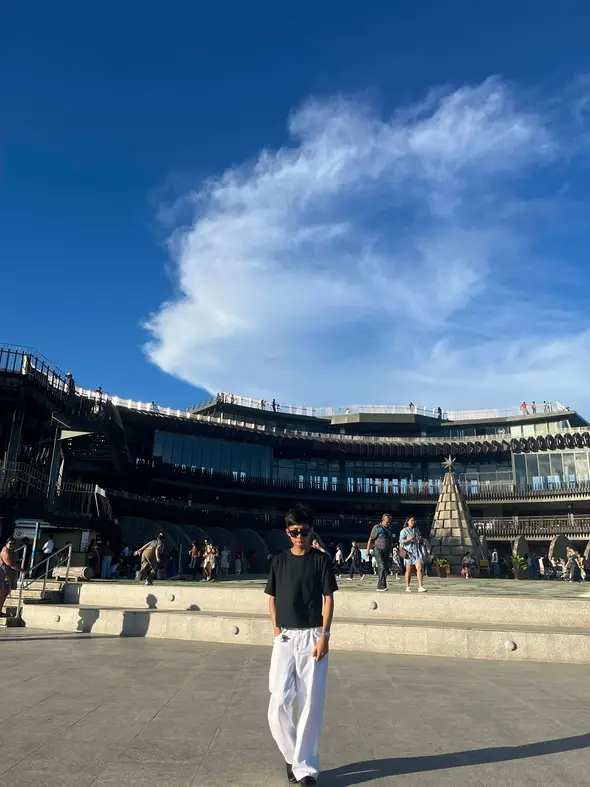

<!DOCTYPE html>

<html>

<head>
    <title>Bernardo Jamili C.- Multimedia Profile</title>

</head>

<body>
    <h1>Bernardo Jamili C.</h1>
    <h2>Personal Information</h2>
    

         My name is Bernardo Jamili C.
        I am a Grade 11 ICT student. 
        My birthday is on Jan 13.
    

    
    

        This image represents me as a learner and future programmer.
    

    

    <h2>About Me</h2>
    

        I always try to improve my coding skills because I want to become a
        successful software developer. Here's a bit about me:
        Hi! My name is Bernardo Jamili C. I am a Grade 11 ICT student who is passionate about technology and programming. I enjoy learning new coding skills and improving my knowledge of web development. My goal is to become a successful software developer in the future.
    

    <h2>My Hobbies and Interests</h2>
    

        These are some of the hobbies and interests that describe me:
    

    <ul>
        <li>Playing online games</li>
        <li> Playing Basketball</li>
        <li>Listen to the music</li>
        <li>Cooking</li>
    </ul>
    <video width="400" controls>
        <source src="index.mp4" type="video/mp4"width="300">
    </video>
    

        This video is related to my hobbies and interests because it represents
        one of the activities that I enjoy during my free time.
    

    <h2>My Top 5 Favorite Foods</h2>
    

        Below are my top five favorite foods:
    

    <ol type="A">
        <li>Adobo</li><li>Lechon</li><li>Chicken</li><li>Chocolates</li><li>French fries</li>
    </ol>
    <h2>My Favorite Things</h2>
    

        I like to sleep, I love the color <b>Blue</b>, and I especially
        <b>love cats</b>.
    

    <audio controls>
        <source src="Taylor Swift-Enchanted.mp3" type="audio/mpeg">
    </audio>
    

        This audio represents one of my favorite songs that helps me relax
        and stay motivated.
    

    

    <h2>My Educational Goals</h2>
    

        These are some of my educational goals as a learner:
    

    <ol>
        <li>Improve my coding skills.</li><li>Learn more about HTML, CSS, JavaScript, and C#.</li><li>Graduate from Senior High School with good grades.</li><li>Become more confident in programming.</li>
    </ol>
    <h2>My Daily Routine</h2>
    

        These are some of the activities I usually do every day:
    

    <ol type="I">
        <li>Wake up and prepare for school.</li><li>Attend my classes and participate in lessons.</li><li>Complete my assignments and projects.</li><li>Practice coding or study ICT lessons.</li><li>Relax by playing games, playing basketball, or cooking.</li><li>Sleep early to prepare for the next day.</li>
    </ol>
    <h2>My Countdown to Success</h2>
    

